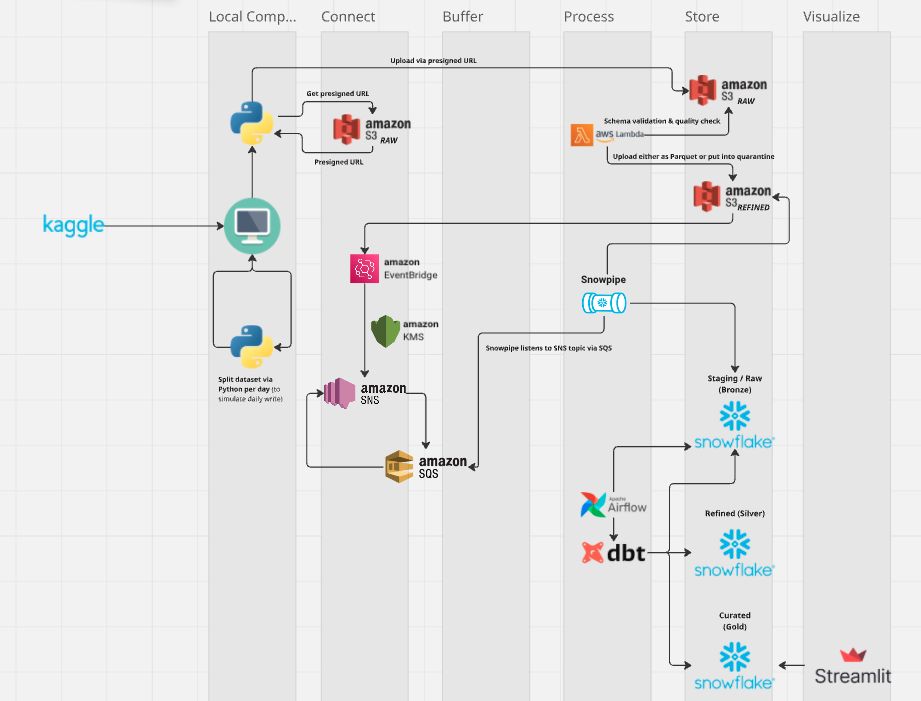
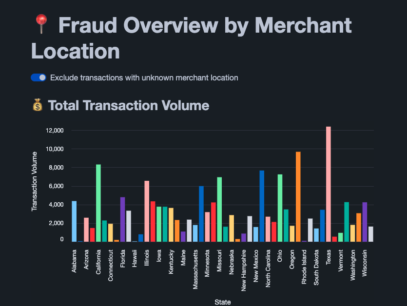
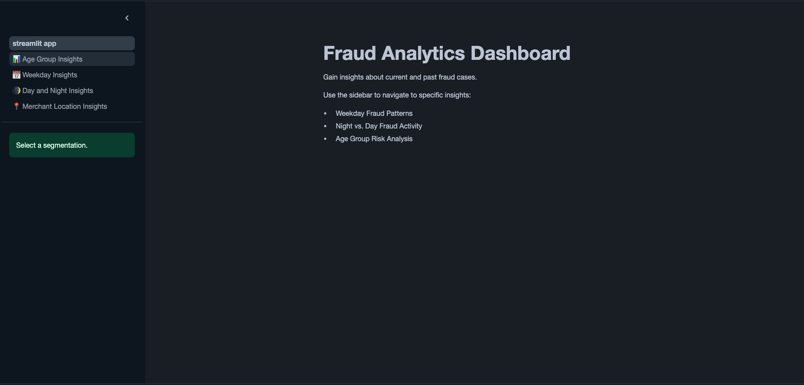
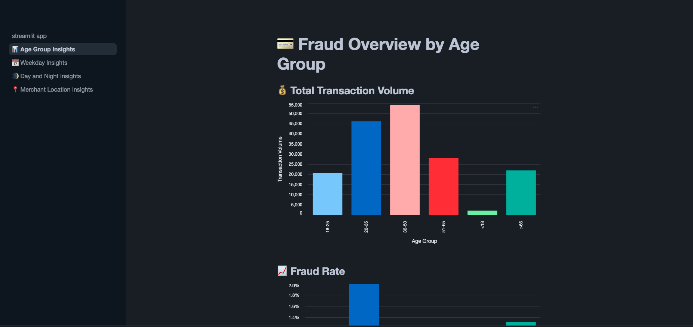
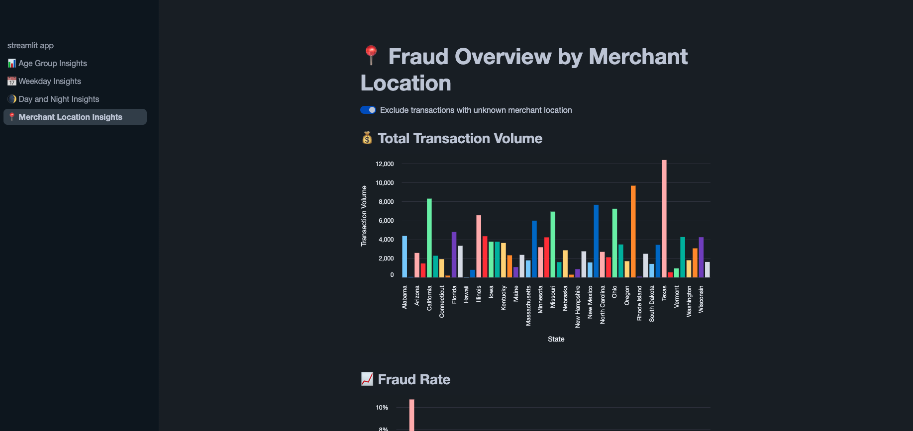
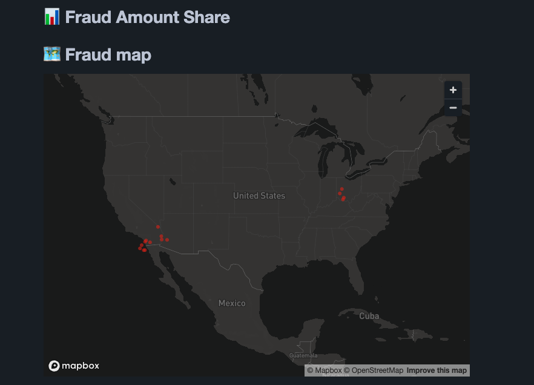

# AWS & Snowflake Batch Processing Pipeline for Credit Card Transactions

# Introduction & Goals

Cloud-native data platforms are reshaping how companies build analytical systems. With a strong background in software engineering and a growing focus on data engineering, I created this end-to-end project to explore modern tools and best practices for building analytical data pipelines in the cloud.

In this project, I worked with a public credit card transaction dataset (sourced from Kaggle) to simulate a real-world fraud detection pipeline. The system is designed to process and transform raw transactional data using scalable, modular components - from ingestion through transformation and orchestration, all the way to a business-facing dashboard.

The goal was to build a production-style analytical pipeline, using best practices such as CI/CD, testing, and modular design and not just to move data, but to do it the right way.

# Contents  

- [1. Architecture Diagram & Data Flow](#1-architecture-diagram--data-flow)
  - [Architecture Diagram](#architecture-diagram)
  - [Data Flow](#data-flow)
- [2. Production-grade Engineering](#2-production-grade-engineering)
- [3. Project Repositories](#3-project-repositories)
  - [Amazon Web Services / Ingestion](#amazon-web-services--ingestion)
  - [Snowflake / Storage](#snowflake--storage)
  - [dbt / Transformation](#dbt--transformation)
  - [Airflow / Orchestration](#airflow--orchestration)
  - [Streamlit / Visualization](#streamlit--visualization)
- [4. Visualizations](#4-visualizations)
- [5. How to run](#5-how-to-run)
- [6. Future Improvements](#6-future-improvements)
- [7. Credits & Mentorship](#7-credits--mentorship)
- [8. About me & Contact](#8-about-me--contact)

# 1. Architecture Diagram & Data Flow

## Architecture Diagram

## Data Flow

This project simulates a near-production data pipeline with minimal manual steps. From local ingestion to analytical visualization, each component is modular and automatically triggered through well-integrated AWS and SaaS services.

While not yet packaged for infrastructure-as-code deployment, the system is built for scalability, modularity, and clarity. The Python scripts work out-of-the-box, and each step is documented and testable.

The whole pipeline requires a single-command to run from start to finish.

### Dataset

The pipeline starts with a publicly available credit card fraud detection dataset from [Kaggle](https://www.kaggle.com/datasets/kartik2112/fraud-detection/data).

To simulate ongoing ingestion (e.g., daily or weekly loads), I created a Python CLI that splits large CSVs into one file per day based on a timestamp column.

Additionally, I incorporated US geo-location data from the [U.S. Census Bureau](https://www.census.gov/programs-surveys/geography/data.html) to enrich transactions with state-level context.

👉 https://github.com/Djirlic/raw-to-daily-splitter

### Ingestion of the data

The ingestion into AWS S3 (Simple Storage Service) can be done manually. However, I preferred a more automated approach. There are several options on how to do that with AWS. But as you can see in the Python script I've created, uploading files with presigned URLs without the need to provide any credentials to the script itself and being capable of handling up to 5TB of data makes it a great alternative to API Gateway (max object size: 10MB).

👉 https://github.com/Djirlic/s3-file-uploader-cli

#### First schema validation

Once a file was successfully uploaded to S3 (raw bucket), an AWS Lambda function gets triggered automatically. This function will use [Polars](https://github.com/pola-rs/polars) to check the schema and decide on how to proceed with the file.

Polars is a great alternative to the well-known Pandas package because of the better performance.

If the file was validated successfully, it is moved to another S3 bucket (refined) and further processed.

If the validation did fail, it will still be moved into the refined bucket, but into the quarantine directory. 

In both cases logs will be made to get information about potential failures but also successfully processed files.

👉 https://github.com/Djirlic/raw-transactions-handler

#### Upload to Snowflake via Snowpipe

To further process the data, Snowpipe will automatically detect new files in the success directory of the refined S3 bucket. The new data will then be loaded into Snowflake.

Snowflake serves as the central data warehouse, receiving data via Snowpipe and storing all processed layers (bronze, silver, gold) for analytical access.

The detection uses the recommended path by Snowflake of using AWS EventBridge, AWS SNS (Simple Notification Service), and AWS SQS (Simple Queue Service). Additionally, I decided to protect the messages sent through a SNS topic via encryption of the KMS (Key Management Service).

### Orchestration

Once the data gets updated in Snowflake, Airflow will run a DAG (Directed Acyclic Graph) to inform dbt of the changes. Airflow runs on the Astronomer platform.

👉 Coming soon

### Transformation

The transformation was done in dbt which runs in the dbt cloud platform. The data takes several steps to get further refined and to become ready for analytical use cases. 

The medallion architecture includes these layers:

- Bronze: Raw Credit Card Data from Snowflake & GeoData from US-states.
- Silver: Enriched data (e.g. having information about merchant locations, age of the cardholder during the transaction, etc.).
- Gold: Final data that can be used for visualization use cases (e.g. fraud during day vs. night, fraud by age group, etc.).

The data was tested (data tests) in each step and full data lineage from source to gold layer is supported. I also documented all models and fields.

👉 https://github.com/Djirlic/cc-transactions-transformer

### Visualization

While Streamlit in Snowflake has some limitations, it enables fast, embedded visualization without external tooling.

An example of the visualization can be seen below. For more examples look into [4. Visualizations](#4-visualizations).

👉 Coming soon

# 2. Production grade engineering

Throughout the pipeline, I applied production-grade engineering practices to ensure security, maintainability, and reliability:

- **Least-privilege access control** was enforced across all components — each AWS, Snowflake, Streamlit, dbt, and Airflow interaction was handled via a dedicated user or role with only the necessary permissions.
- **Secrets and credentials** were securely managed using GitHub environment secrets and never hardcoded or shared within the codebase.
- All **Python code is fully linted, formatted, and tested** via CI/CD pipelines using tools like [black](https://github.com/psf/black), [flake8](https://github.com/pycqa/flake8), [mypy](https://github.com/python/mypy), [pytest](https://github.com/pytest-dev/pytest), and later [uv](https://github.com/astral-sh/uv).
- **Project structure** was modular and reproducible, following clear separation of concerns between ingestion, transformation, orchestration, and visualization.
- **Open-source tooling** was used where possible (e.g., Polars, dbt, Streamlit), ensuring transparency and extensibility.
- **Schema validation and logging** were built in from the start, including structured handling of failed ingestion attempts through Dead Letter Queues (DLQs) and quarantine directories.
- **Documentation** was written for every component to make onboarding, understanding, and extension easier — with a global README tying it all together.
- **High test coverage**, with most components reaching close to 100%. This ensures confidence in core logic and easier future refactoring.
- **Fault isolation through quarantine directories**, allowing malformed or invalid data to be flagged, investigated, and optionally reprocessed manually.
- **CI/CD pipelines for multiple components**, enforcing code quality through automated linting, formatting, and testing. For the AWS Lambda function, deployment is fully automated via Docker—including all third-party dependencies bundled into a Lambda Layer to avoid duplicated dependency definitions.

# 3. Project Repositories

## Amazon Web Services / Ingestion
- [Raw-to-daily-splitter](https://github.com/Djirlic/raw-to-daily-splitter): A Python CLI tool to split a raw CSV file into daily CSV files, one per date by a given date column.
- [s3-file-uploader-cli](https://github.com/Djirlic/s3-file-uploader-cli): A Python CLI tool to upload files to an AWS S3 bucket using a presigned URL. Designed for data engineering workflows, automation pipelines, and robust CLI-based file ingestion.
- [Raw Transaction Handler](https://github.com/Djirlic/raw-transactions-handler): A serverless data ingestion and transformation pipeline using AWS Lambda, designed to validate, transform, and route raw financial transaction data to a refined data bucket. The pipeline also maintains structured logs for successful and failed processing attempts.

## Snowflake / Storage

Coming soon.

## dbt / Transformation

- [Creditcard Transaction Transformer](https://github.com/Djirlic/cc-transactions-transformer): Transforms raw data from a connected warehouse (in my case Snowflake) into bronze, silver, and gold layers (medallion architecture).

## Airflow / Orchestration

Coming soon.

## Streamlit / Visualization

Coming soon.

# 4. Visualizations

The final pipeline output is a simple Streamlit dashboard to help answer key analytical questions, such as:

- Which age group does have the highest transaction volume?
- Which age group is most likely to experience fraudulent transactions?
- On which day of the week does fraud most frequently occur?
- Are night-time transactions more likely to be fraudulent?
- Which U.S. states report the hightest number of fraud cases?

All this information can help the business decide on how to adapt the algorithm to label transactions as fraud.

Below are example screenshots of the Streamlit dashboard visualizing answers to these questions:

> [!NOTE]  
> The following screenshots were taken after uploading data for a single day. Final visualizations based on the full dataset may show different patterns and results.

_Entry point of the Streamlit dashboard._

_Total transaction volume by age group._

_Total transaction volume by merchant location (state)._

_A map of the states with fraud cases highlighted._

# 5. How to Run

This project is not designed to be run with a single command, and currently does not include infrastructure as code for full environment setup. 

However, the Python scripts are ready to use with minimal setup (mainly an AWS account and S3 bucket).

Please refer to each sub-repository for detailed setup and usage information.

# 6. Future Improvements

While this project successfully meets its initial scope and delivers a complete end-to-end pipeline, there are several areas worth exploring to deepen my expertise and bring the system closer to a real-world production setup:

- **Extract the visualization from Streamlit in Snowflake (SiS)** 
Extracting visualizations from SiS into a standalone Streamlit instance or other visualization tool could increase the options, like adding heatmaps for merchant locations, that were not possible due to limitations in SiS.

- **Natural Language Querying via AWS Bedrock (GenAI)** 
Integrating a GenAI interface to allow stakeholders to query data using natural language prompts would significantly increase accessibility and open up self-service analytics.

- **Enhanced Observability & Monitoring** 
While dead-letter queues (DLQs) and logging are already in place, adding alerting, metrics dashboards, and structured traceability would make the system easier to debug and maintain.

- **Incremental Models in dbt**  
Switching from full refreshes to incremental models builds in dbt would reduce compute cost and improve processing efficiency, especially at scale.

- **Infracstructure as Code with AWS CDK** 
Defining the infrastructure using the AWS Cloud Development Kit (CDK) would ensure reproducibility and make environment setup more robust and automated.

- **CI/CD for dbt and Airflow** 
Add GitHub Actions to validate and deploy dbt models and DAGs, bringing full automation to the workflow.

- **Data Quality Monitoring (e.g., Great Expectations or Soda)** 
Integrate a framework for validating data contracts and schema changes in production.

- **Cost Monitoring (Snowflake)** 
Add cost tracking and warehouse usage reporting to gain better visibility into pipeline efficiency.

# 7. Credits & Mentorship

This project was created as part of my mentorship through [LearnDataEngineering](https://learndataengineering.com).

A special thanks to [Andreas Kretz](https://github.com/team-data-science) and [Arockia Nirmal Amala Doss](https://github.com/arockianirmal26) for their valuable guidance and recommendations throughout this project. Their real-world experience and feedback played a key role in shaping both the technical and architectural decisions.

# 8. About Me & Contact

I'm a freelance data engineer based in Germany, experienced in building modern data platforms with:

- PostgreSQL
- AWS
- Azure
- Snowflake
- Microsoft Fabric
- dbt
- Airflow
- Streamlit

With over 10 years experience as a software engineer, I've developed production-grade
applications for major German companies such as [Fressnapf](https://www.fressnapf.de/), leading social lotteries, automotive manufacturers, and industrial clients.

If you looking for someone who can drive innovation, build your data platform from the ground up or take your existing stack to the next level, feel free to get in touch:

📧 [Email](freelance(at)djirlic.com) 
🔗 [LinkedIn](https://www.linkedin.com/in/djirlic/)
